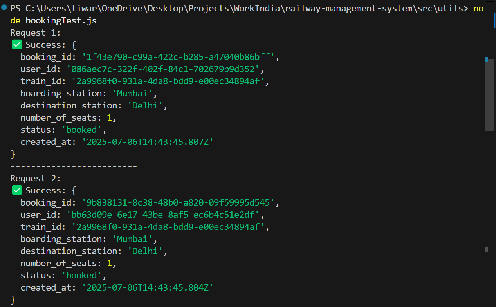
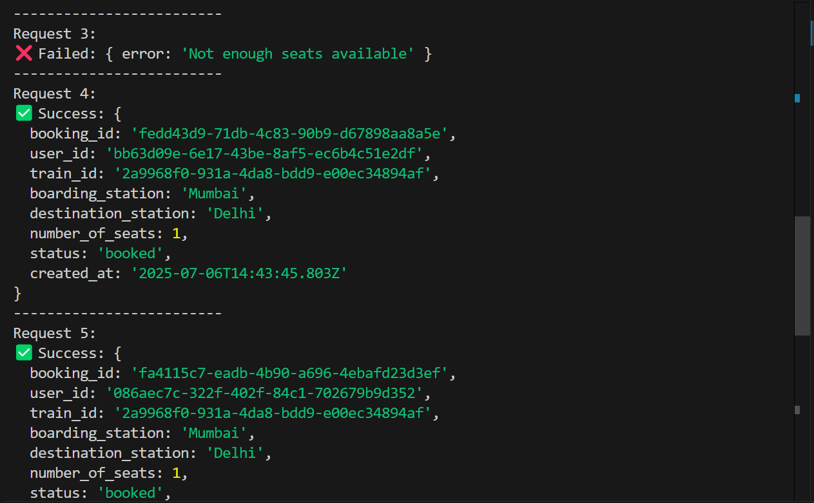

# Railway Management System API

A modular, scalable IRCTC-like backend API built with Node.js, Express.js, and Supabase PostgreSQL. It enables user registration, login, train search, seat booking with concurrency handling, and admin functionality for managing trains.

Supports:
- Role-based access (user & admin)
- Seat availability tracking
- Race condition handling using PostgreSQL row locks
- Station-wise train mapping

## Tech Stack

- Node.js + Express.js
- Supabase (PostgreSQL)
- JWT for authentication & role-based authorization
- pg (PostgreSQL client)
- Postman for API testing
- dotenv, nodemon

## Folder Structure

src/
├── config/ # Environment setup and DB clients
├── controller/ # Handles request/response logic
├── database/ # Table creation scripts
├── middleware/ # JWT, admin auth
├── models/ # Data models 
├── repository/ # DB access logic 
├── routes/ # Express route definitions
├── schemas/ # Table creation schemas
├── service/ # Business logic
├── utils/ # Test scripts (e.g., race condition test)

> ✅ Clean modular architecture using the **repository design pattern** to separate DB logic and business logic.

### 4. **How to Setup**

```markdown
## Setup Instructions

1. Clone the repository:
git clone https://github.com/tiwarekarsanika/railway-management-system.git

2. Install dependencies:
npm install

3. Set up environment variables:
- Copy `.env.example` to `.env` and fill in the values:
  ```
  SUPABASE_DB_URL=your_database_url
  SUPABASE_API_URL=your_api_url
  SUPABASE_ANON_KEY=your_annonymous_key
  JWT_SECRET=your_jwt_secret
  ADMIN_API_KEY=your_admin_key
  PORT=port_number
  ```
```

4. Run database table creation script:
node src/database/initialiseDB.js

5. Start the development server:
nodemon server.js

> **Do not push your `.env` file**. Keep it in `.gitignore`.

## API Endpoints

### 🔓 Public
- `POST /api/users/registerUser` – Register user
- `POST /api/users/loginUser` – Login & receive JWT
- `GET /api/trains/getAllTrainsBySourceAndDestination` - Fetch train details running between specific source and destination (requires source and destination query parameters)

### 🔐 Protected (JWT Required)
- `POST /api/bookings/createBooking` – Book seats (requires token + user_id + train_id in query)
- `GET /api/bookings/:bookingId` – Get booking details (requires token + booking_id)

### 👨‍💼 Admin Only (JWT + API Key)
- `POST /api/trains/addTrain` – Add new train with stations
- `GET /api/admin/allBookings` – View all bookings

## Concurrency Handling

Booking service uses PostgreSQL `SELECT ... FOR UPDATE` row locking inside a transaction to handle race conditions. When multiple users attempt to book simultaneously, only the first N transactions (based on available seats) succeed.

Test script in `src/utils/bookingTest.js` simulates 6 concurrent requests when only 5 seats are available. Response: 5 succeeded, 1 failed — confirming race condition handling works.




## Assumptions

- A train can run on different days but is identified by a unique `train_id` per entry
- Only one seat class is supported (for simplicity)
- Users can book multiple seats in one request
- All admin routes are protected using a static API key in addition to JWT

## Testing

- All routes tested using Postman
- Race condition tested using concurrent Axios script in `utils/bookingTest.js`

## Future Enhancements

- Add per-seat selection and seat layout
- Integrate payment gateway
- Add train recurrence (same train code across dates)
- Pagination and filtering for search
